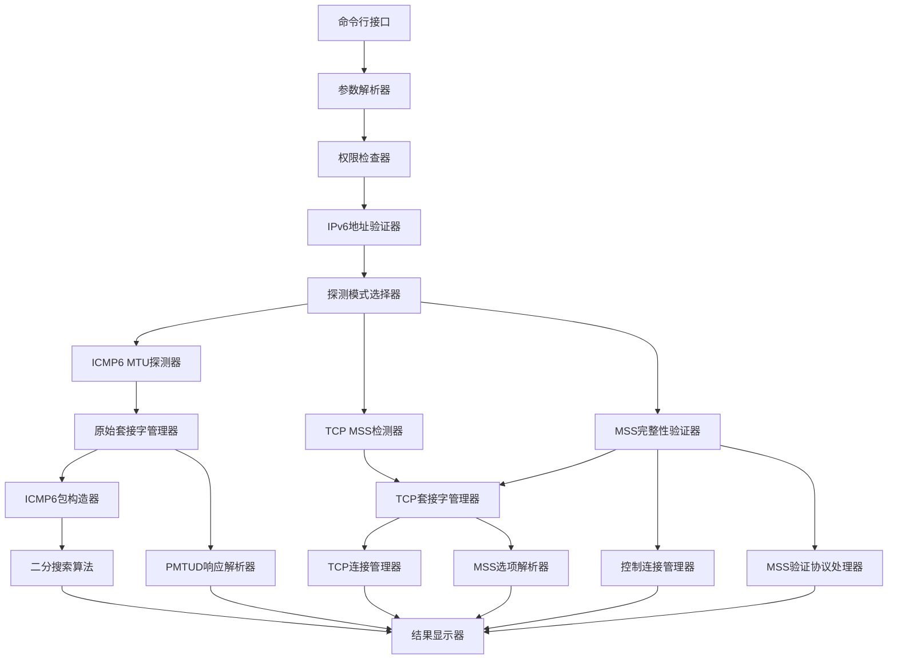

# IPv6 MTU探测工具设计文档

## 概述

IPv6 MTU探测工具是一个命令行应用程序，用于发现网络路径的最小MTU大小，并检测TCP MSS钳制功能。该工具使用原始套接字发送ICMP6探测包和TCP连接来执行MTU发现和MSS钳制检测。

## 架构

### 整体架构



### 模块分层

1. **表示层**: 命令行接口和结果显示
2. **业务逻辑层**: MTU探测算法和MSS检测逻辑
3. **网络层**: 套接字管理和数据包处理
4. **工具层**: 地址验证、权限检查等辅助功能

## 组件和接口

### 1. 命令行接口模块 (CLI)

**职责**: 处理用户输入和参数解析

```go
type CLIArgs struct {
    TargetIPv6    string
    Mode          ProbeMode // MTU探测, TCP客户端MSS, TCP服务端MSS, MSS完整性验证
    Port          int       // TCP模式使用的端口
    ControlPort   int       // MSS验证通信使用的控制端口
    TestMSS       int       // 用于MSS篡改检测的测试MSS值
    Verbose       bool
    Timeout       time.Duration
    VerifyMSS     bool      // 是否启用MSS完整性验证
}

type ProbeMode int

const (
    ModeMTUProbe ProbeMode = iota
    ModeTCPClientMSS
    ModeTCPServerMSS
    ModeMSSIntegrityCheck
)

func ParseArguments() (*CLIArgs, error)
func PrintUsage()
```

### 2. IPv6地址验证器 (AddressValidator)

**职责**: 验证IPv6地址格式和基本可达性

```go
type IPv6Address struct {
    IP        net.IP
    IsValid   bool
}

func ValidateIPv6Address(addrStr string) (*IPv6Address, error)
```

### 3. 权限检查器 (PermissionChecker)

**职责**: 检查root权限

```go
type PermissionChecker struct{}

func NewPermissionChecker() *PermissionChecker
func (pc *PermissionChecker) CheckRootPrivileges() error
func (pc *PermissionChecker) PrintPermissionError()
```

### 4. ICMP6 MTU探测器 (ICMP6Prober)

**职责**: 执行ICMP6 MTU探测和简化的不可达检测

```go
type ICMP6Prober struct {
    conn       *icmp.PacketConn
    target     *net.IPAddr
    currentMTU int
    minMTU     int
    maxMTU     int
    probeCount int
}

type MTUResult struct {
    MTUFound       bool
    FinalMTU       int
    ProbeAttempts  int
    PMTUDResponses []PMTUDResponse
    IsUnreachable  bool  // 简化的不可达检测结果
    UnreachableReason string // 不可达原因
}

func NewICMP6Prober(target *IPv6Address) (*ICMP6Prober, error)
func (p *ICMP6Prober) ProbeMTU(ctx context.Context) (*MTUResult, error)
func (p *ICMP6Prober) CheckReachability(ctx context.Context) (bool, error) // 简单的可达性检查
func (p *ICMP6Prober) Close() error
```

### 5. ICMP6包构造器 (PacketBuilder)

**职责**: 构造ICMP6探测包

```go
type ICMP6Packet struct {
    Type     ipv6.ICMPType
    Code     int
    Checksum int
    Body     icmp.MessageBody
    Data     []byte
}

func BuildICMP6Packet(payloadSize int) (*ICMP6Packet, error)
func (p *ICMP6Packet) Marshal() ([]byte, error)
func SendICMP6Probe(conn *icmp.PacketConn, target *net.IPAddr, packet *ICMP6Packet) error
```

### 6. PMTUD响应解析器 (PMTUDParser)

**职责**: 解析PMTUD响应消息

```go
type PMTUDResponse struct {
    Type        ipv6.ICMPType
    Code        int
    ReportedMTU int
    RouterAddr  net.IP
    Timestamp   time.Time
}

func ParsePMTUDResponse(data []byte) (*PMTUDResponse, error)
func (r *PMTUDResponse) IsPacketTooBig() bool
func (r *PMTUDResponse) String() string
```

### 7. TCP MSS检测器 (MSSDetector)

**职责**: 检测TCP MSS钳制和MSS篡改

```go
type MSSDetector struct {
    target        *IPv6Address
    mode          ProbeMode
    port          int
    controlPort   int           // MSS验证通信端口
    originalMSS   int
    listener      net.Listener  // 服务端模式使用
    controlConn   net.Conn      // 控制连接用于MSS验证信息交换
}

type MSSResult struct {
    MSSClamped        bool
    OriginalMSS       int
    ClampedMSS        int
    ConnectionSuccess bool
    // MSS篡改检测结果
    MSSIntegrityCheck bool
    ClientSentMSS     int
    ServerReceivedMSS int
    MSSModified       bool
    ModificationDelta int
}

type MSSVerificationInfo struct {
    ClientMSS     int
    ServerMSS     int
    Timestamp     time.Time
    SessionID     string
}

func NewMSSDetector(target *IPv6Address, mode ProbeMode, port, controlPort int) (*MSSDetector, error)
func (d *MSSDetector) DetectMSSClamping(ctx context.Context) (*MSSResult, error)
func (d *MSSDetector) VerifyMSSIntegrity(ctx context.Context, testMSS int) (*MSSResult, error)
func (d *MSSDetector) EstablishControlConnection(ctx context.Context) error
func (d *MSSDetector) ExchangeVerificationInfo(info *MSSVerificationInfo) (*MSSVerificationInfo, error)
func (d *MSSDetector) Close() error
```

### 8. TCP连接管理器 (TCPManager)

**职责**: 管理TCP连接和MSS选项

```go
type TCPManager struct {
    conn        net.Conn
    controlConn net.Conn  // 用于MSS验证的控制连接
}

type TCPConnectionInfo struct {
    LocalAddr     net.Addr
    RemoteAddr    net.Addr
    LocalMSS      int
    RemoteMSS     int
    EffectiveMSS  int
    ConnectedAt   time.Time
}

func NewTCPManager() *TCPManager
func (tm *TCPManager) CreateTCPv6Socket() (net.Conn, error)
func (tm *TCPManager) SetMSSOption(conn net.Conn, mss int) error
func (tm *TCPManager) GetMSSOption(conn net.Conn) (int, error)
func (tm *TCPManager) GetConnectionInfo(conn net.Conn) (*TCPConnectionInfo, error)
func (tm *TCPManager) ConnectTCPv6(target *net.TCPAddr, timeout time.Duration) (net.Conn, error)
func (tm *TCPManager) ConnectWithMSS(target *net.TCPAddr, mss int, timeout time.Duration) (net.Conn, error)
func (tm *TCPManager) ListenTCPv6(addr *net.TCPAddr) (net.Listener, error)
func (tm *TCPManager) AcceptWithMSSCapture(listener net.Listener) (net.Conn, int, error)
func (tm *TCPManager) EstablishControlChannel(addr *net.TCPAddr) (net.Conn, error)
func (tm *TCPManager) SendVerificationData(conn net.Conn, data []byte) error
func (tm *TCPManager) ReceiveVerificationData(conn net.Conn) ([]byte, error)
```

### 9. 二分搜索算法 (BinarySearch)

**职责**: 实现MTU二分搜索

```go
type BinarySearch struct {
    Low        int
    High       int
    Current    int
    Iterations int
    MaxIter    int
}

func NewBinarySearch(minVal, maxVal int) *BinarySearch
func (bs *BinarySearch) Next() int
func (bs *BinarySearch) Update(success bool) bool
func (bs *BinarySearch) IsDone() bool
func (bs *BinarySearch) GetResult() int
```

### 10. MSS完整性验证器 (MSSIntegrityVerifier)

**职责**: 执行MSS篡改检测和完整性验证

```go
type MSSIntegrityVerifier struct {
    detector     *MSSDetector
    tcpManager   *TCPManager
    testMSS      int
    controlPort  int
    sessionID    string
}

type IntegrityTestSession struct {
    SessionID     string
    ClientAddr    net.Addr
    ServerAddr    net.Addr
    TestMSS       int
    StartTime     time.Time
    Status        SessionStatus
}

type SessionStatus int

const (
    SessionPending SessionStatus = iota
    SessionActive
    SessionCompleted
    SessionFailed
)

func NewMSSIntegrityVerifier(detector *MSSDetector, testMSS, controlPort int) *MSSIntegrityVerifier
func (miv *MSSIntegrityVerifier) StartVerificationSession(ctx context.Context) (*IntegrityTestSession, error)
func (miv *MSSIntegrityVerifier) ExecuteClientSideTest(ctx context.Context, session *IntegrityTestSession) (*MSSResult, error)
func (miv *MSSIntegrityVerifier) ExecuteServerSideTest(ctx context.Context, session *IntegrityTestSession) (*MSSResult, error)
func (miv *MSSIntegrityVerifier) CompareResults(clientResult, serverResult *MSSVerificationInfo) *MSSResult
func (miv *MSSIntegrityVerifier) Close() error
```

### 11. 控制连接管理器 (ControlConnectionManager)

**职责**: 管理MSS验证的控制连接

```go
type ControlConnectionManager struct {
    listener    net.Listener
    connections map[string]net.Conn
    port        int
}

type ControlMessage struct {
    Type      MessageType
    SessionID string
    Data      []byte
    Timestamp time.Time
}

type MessageType int

const (
    MsgHandshake MessageType = iota
    MsgMSSInfo
    MsgVerificationResult
    MsgError
    MsgClose
)

func NewControlConnectionManager(port int) *ControlConnectionManager
func (ccm *ControlConnectionManager) StartListener(ctx context.Context) error
func (ccm *ControlConnectionManager) AcceptConnection(ctx context.Context) (net.Conn, error)
func (ccm *ControlConnectionManager) SendMessage(conn net.Conn, msg *ControlMessage) error
func (ccm *ControlConnectionManager) ReceiveMessage(conn net.Conn) (*ControlMessage, error)
func (ccm *ControlConnectionManager) CloseConnection(sessionID string) error
func (ccm *ControlConnectionManager) Close() error
```

### 12. 结果显示器 (ResultDisplay)

**职责**: 格式化和显示结果

```go
type ResultDisplay struct {
    verbose bool
    writer  io.Writer
}

func NewResultDisplay(verbose bool, writer io.Writer) *ResultDisplay
func (rd *ResultDisplay) DisplayMTUResult(result *MTUResult)
func (rd *ResultDisplay) DisplayMSSResult(result *MSSResult)
func (rd *ResultDisplay) DisplayMSSIntegrityResult(result *MSSResult)
func (rd *ResultDisplay) DisplayProgress(currentMTU, attempt int)
func (rd *ResultDisplay) DisplayPMTUDInfo(response *PMTUDResponse)
func (rd *ResultDisplay) DisplayVerificationProgress(step string)
func (rd *ResultDisplay) DisplayError(err error)
```

## 数据模型

### 核心数据结构

```go
// 主应用程序状态
type AppState struct {
    Args         *CLIArgs
    TargetAddr   *IPv6Address
    ICMPProber   *ICMP6Prober
    MSSDetector  *MSSDetector
    Running      bool
    Context      context.Context
    CancelFunc   context.CancelFunc
}

// 探测会话
type ProbeSession struct {
    StartTime        time.Time
    TotalProbes      int
    SuccessfulProbes int
    TimeoutCount     int
    ErrorCount       int
    Duration         time.Duration
}

// 网络统计
type NetworkStats struct {
    PacketsSent     int
    PacketsReceived int
    ICMPErrors      int
    Timeouts        int
    AvgRTT          time.Duration
    MinRTT          time.Duration
    MaxRTT          time.Duration
}

// 配置结构
type Config struct {
    TimeoutMS       int           `json:"timeout_ms"`
    MaxRetries      int           `json:"max_retries"`
    VerboseLevel    int           `json:"verbose_level"`
    ProbeIntervalMS int           `json:"probe_interval_ms"`
    MinMTUSize      int           `json:"min_mtu_size"`
    MaxMTUSize      int           `json:"max_mtu_size"`
    DefaultTCPPort  int           `json:"default_tcp_port"`
}
```

## IPv6不可达检测逻辑

### 简化的不可达检测策略

根据需求4的要求，IPv6不可达检测采用简单直接的方法：

1. **初始连通性检查**: 在开始MTU探测之前，发送一个标准大小的ICMP6 Echo Request包
2. **Echo回复检测**: 如果没有收到对应的Echo Reply，则判定目标不可达
3. **立即终止**: 一旦检测到不可达，立即停止MTU探测过程并报告结果

### 不可达检测实现

```go
// 简化的不可达检测接口
type UnreachabilityChecker struct {
    conn    *icmp.PacketConn
    target  *net.IPAddr
    timeout time.Duration
}

func NewUnreachabilityChecker(target *net.IPAddr, timeout time.Duration) *UnreachabilityChecker
func (uc *UnreachabilityChecker) IsReachable(ctx context.Context) (bool, string, error)
func (uc *UnreachabilityChecker) Close() error
```

### 检测流程

1. 发送ICMP6 Echo Request (ping6)
2. 等待Echo Reply响应
3. 如果收到Echo Reply -> 目标可达，继续MTU探测
4. 如果超时无响应 -> 目标不可达，停止探测
5. 如果收到ICMP错误 -> 根据错误类型判断不可达原因

### 移除的复杂功能

为了简化实现，以下复杂的检测功能将被移除：
- 复杂的模式分析 (ResponsePatternAnalyzer)
- 多重验证机制 (ReachabilityValidator)
- 连续失败阈值检测
- 失败率统计分析
- 缓存机制

## 错误处理

### 错误类型定义

```go
// 自定义错误类型
type ProbeError struct {
    Code    ErrorCode
    Message string
    Cause   error
}

func (e *ProbeError) Error() string {
    if e.Cause != nil {
        return fmt.Sprintf("%s: %v", e.Message, e.Cause)
    }
    return e.Message
}

type ErrorCode int

const (
    ErrSuccess ErrorCode = iota
    ErrInvalidArgs
    ErrPermissionDenied
    ErrInvalidIPv6
    ErrSocketCreate
    ErrSocketBind
    ErrSendFailed
    ErrRecvTimeout
    ErrTargetUnreachable
    ErrMTUTooSmall
    ErrMSSDetectionFailed
    ErrContextCanceled
)

// 错误构造函数
func NewProbeError(code ErrorCode, message string, cause error) *ProbeError
func IsTimeoutError(err error) bool
func IsPermissionError(err error) bool
```

### 错误处理策略

1. **输入验证错误**: 立即返回错误码并显示使用说明
2. **权限错误**: 显示权限要求并退出
3. **网络错误**: 重试机制（最多3次）
4. **超时错误**: 记录并继续下一次探测
5. **系统错误**: 记录日志并优雅退出

## 测试策略

### 单元测试

1. **地址验证测试**
   - 有效IPv6地址格式
   - 无效IPv6地址格式
   - 边界情况（空字符串、过长地址等）

2. **数据包构造测试**
   - ICMP6包格式正确性
   - 不同载荷大小的包构造
   - 包大小计算准确性

3. **二分搜索算法测试**
   - 正常搜索流程
   - 边界值处理
   - 收敛性验证

### 集成测试

1. **MTU探测流程测试**
   - 完整的MTU发现过程
   - PMTUD响应处理
   - 超时和重试机制

2. **MSS检测流程测试**
   - 客户端模式MSS检测
   - 服务端模式MSS检测
   - MSS钳制检测准确性

### 系统测试

1. **网络环境测试**
   - 不同MTU大小的网络
   - 有MSS钳制的网络
   - 高延迟网络环境

2. **错误场景测试**
   - 目标不可达
   - 权限不足
   - 网络中断

## 性能考虑

### 优化策略

1. **探测效率**
   - 使用二分搜索减少探测次数
   - 并行发送多个探测包（可选）
   - 智能超时调整

2. **内存管理**
   - 预分配缓冲区
   - 避免频繁内存分配
   - 及时释放资源

3. **网络优化**
   - 合理的超时设置
   - 避免过于频繁的探测
   - 缓存DNS解析结果

### 资源限制

- 最大探测时间: 30秒
- 最大重试次数: 3次
- 内存使用限制: < 10MB
- CPU使用率: < 5%

## 安全考虑

### 权限管理

1. **最小权限原则**
   - 仅在需要时请求root权限
   - 探测完成后降低权限
   - 避免不必要的系统调用

2. **输入验证**
   - 严格验证IPv6地址格式
   - 限制端口号范围
   - 防止缓冲区溢出

### 网络安全

1. **探测行为**
   - 限制探测频率避免被误认为攻击
   - 使用标准ICMP6类型
   - 遵循网络礼仪

2. **数据保护**
   - 不记录敏感网络信息
   - 避免泄露本地网络拓扑
   - 安全的错误消息

## 部署和配置

### 编译要求

- Go 1.19+ 
- 支持IPv6的操作系统 (Linux, macOS, Windows)
- CGO支持（用于底层网络操作）

### Go模块依赖

```go
module ipv6-mtu-discovery

go 1.19

require (
    golang.org/x/net v0.10.0
    golang.org/x/sys v0.8.0
    github.com/spf13/cobra v1.7.0
    github.com/spf13/viper v1.16.0
)
```

### 运行时依赖

- Root权限（Linux/macOS用于原始套接字）
- 管理员权限（Windows用于原始套接字）
- IPv6网络连接
- 防火墙允许ICMP6和TCP连接

### 配置选项

```go
// 默认配置常量
const (
    DefaultTimeoutMS         = 5000
    MaxRetries              = 3
    MinMTUSize             = 68
    MaxMTUSize             = 1500
    DefaultTCPPort         = 80
    DefaultControlPort     = 8080
    DefaultTestMSS         = 1460  // 故意使用较大的MSS值进行测试
    DefaultProbeInterval   = 100   // ms
    DefaultSessionTimeout  = 30000 // ms
    MaxConcurrentSessions  = 10
)

// 配置文件支持 (YAML/JSON)
type AppConfig struct {
    Network struct {
        TimeoutMS       int `yaml:"timeout_ms" json:"timeout_ms"`
        MaxRetries      int `yaml:"max_retries" json:"max_retries"`
        ProbeIntervalMS int `yaml:"probe_interval_ms" json:"probe_interval_ms"`
    } `yaml:"network" json:"network"`
    
    MTU struct {
        MinSize int `yaml:"min_size" json:"min_size"`
        MaxSize int `yaml:"max_size" json:"max_size"`
    } `yaml:"mtu" json:"mtu"`
    
    TCP struct {
        DefaultPort        int `yaml:"default_port" json:"default_port"`
        DefaultControlPort int `yaml:"default_control_port" json:"default_control_port"`
        DefaultTestMSS     int `yaml:"default_test_mss" json:"default_test_mss"`
    } `yaml:"tcp" json:"tcp"`
    
    MSSVerification struct {
        EnableIntegrityCheck bool `yaml:"enable_integrity_check" json:"enable_integrity_check"`
        SessionTimeoutMS     int  `yaml:"session_timeout_ms" json:"session_timeout_ms"`
        MaxSessions          int  `yaml:"max_sessions" json:"max_sessions"`
    } `yaml:"mss_verification" json:"mss_verification"`
    
    Logging struct {
        Level   string `yaml:"level" json:"level"`
        Verbose bool   `yaml:"verbose" json:"verbose"`
    } `yaml:"logging" json:"logging"`
}

func LoadConfig(configPath string) (*AppConfig, error)
func (c *AppConfig) Validate() error
```

### 跨平台支持

```go
// 平台特定的实现
// +build linux darwin

func createRawSocket() (int, error) {
    // Unix系统实现
}

// +build windows

func createRawSocket() (int, error) {
    // Windows系统实现
}

// 权限检查的跨平台实现
func checkPrivileges() error {
    switch runtime.GOOS {
    case "linux", "darwin":
        return checkUnixPrivileges()
    case "windows":
        return checkWindowsPrivileges()
    default:
        return fmt.Errorf("unsupported platform: %s", runtime.GOOS)
    }
}
```